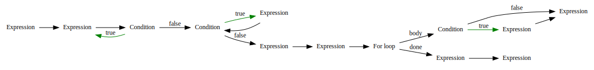

# Uclang - programming language

<!-- {{{ -->
Uclang is interpreted, dynamically typed, object-oriented, general purpose
programming language defined mainly by its interpreter. Language and its
interpreter are based on set of simple rules.

  * All values are objects.
  * There are no any global functions.
  * All actions are performed by methods of objects.

Uclang was designed as fully interpreted language, so its performance falls to
class of interpreted languages like Lua or Python. Intermediate code
generated from source strings is not translated to machine code by any sort of
JIT compilation.

Basic data types such are Integers, Floats and Strings are implemented as
standard language module, which is treated same way as any C/C++ user modules.

For computationally expensive tasks author of Uclang language prefers C/C++
implementation of algorithms as set of functions or library, and then its
integration to Uclang as standalone module. Such modules can be then
effectively glued to each other.  List of modules so far implemented for
language Uclang can be found
[here](https://github.com/izuzanak/uclang#language-modules).

This text contains mainly examples and brief description of language principles
and features, divided to few categories.

<!-- }}} -->

## Syntax of language

<!-- {{{ -->
Syntax of Uclang is mainly derived from programming language C/C++ with
influence of programming language Java.  Syntax of Java language influenced
syntax of class inheritance and inheritance related constructs.

### Basic syntax

<!-- {{{ -->
Classes can be defined on top level or can be nested in parent class. Member
variables and methods must be declared inside some parent class.  Executed
script and all its imported modules should contain one class of name `Main`,
with `static` and `public` method `main#1`, this method will be executed as
program entry point.

**Example:**

```cpp
class Main
{
  static public main(argv)
  {
    "Hello world!!!\n".print();
  }
}
```

```
Hello world!!!
```
<!-- }}} -->

### Syntax of operators

<!-- {{{ -->
Operators of language are mainly derived from language C/C++. Precedence of
operators is also preserved. Operators are translated to equivalent method
calls. For example entry `a += b` is translated to call of method
`a.operator_binary_plus_equal(b)`.

**Example:**

```cpp
class Main
{
  static public main(argv)
  {
    a = b = 10;
    b = a + (a++ + ++b) / b;
    ("a: %d, b: %d\n" % [a,b]).print();
  }
}
```

```
a: 11, b: 12
```

Intermediate code generated from example code.

```
-- begin_code --
i_const: 3 <- const: 0
i_const: 7 <- const: 2
i_expression_end
-- run_time_code --
58: i_call: 4 <- operator_binary_equal#1 params: 2,3,
58: i_call: 5 <- operator_binary_equal#1 params: 1,4,
i_expression_end
77: i_call: 5 <- operator_unary_post_double_plus#0 params: 1,
82: i_call: 4 <- operator_unary_pre_double_plus#0 params: 2,
82: i_call: 6 <- operator_binary_plus#1 params: 5,4,
87: i_call: 4 <- operator_binary_slash#1 params: 6,2,
87: i_call: 6 <- operator_binary_plus#1 params: 1,4,
87: i_call: 4 <- operator_binary_equal#1 params: 2,6,
i_expression_end
118: i_element_array: 4 <- 1,2,
118: i_call: 6 <- operator_binary_percent#1 params: 7,4,
127: i_call: 4 <- print#0 params: 6,
i_expression_end
```

<!-- }}} -->

### Syntax of branches and loops

<!-- {{{ -->
Language syntax supports various forms of flow branching and looping
constructs.  Significant subset of flow branching and looping syntax is derived
from C like languages. Details about [flow
branching](https://github.com/izuzanak/uclang/blob/master/uclang/doc/01_syntax/06_flow_branching.md)
and [flow looping
syntax](https://github.com/izuzanak/uclang/blob/master/uclang/doc/01_syntax/07_flow_loops.md)
can be found in documentation.

**Example**

```cpp
import containers;
import algorithms;

class Main
{
  static public main(argv)
  {
    idx = 0;

    do { ++idx; } while(idx < 100);
    while (idx > 0) { --idx; }

    greater = lesser = 0;

    for (value <- new Range(0,1000))
    {
      if (value > 750) ++greater;
      lesser += value < 250 ? 1 : 0;
    }

    ("greater: %d\n" % greater).print();
    ("lesser:  %d\n" % lesser).print();
  }
}
```

```
greater: 250
lesser:  250
```

Program flow graph of method `Main.main#1`.



<!-- }}} -->

### Syntax of classes and inheritance

<!-- {{{ -->
Classes can inherit properties from other classes by use of keyword `extends`
and name of super class in their declaration.

Interface classes can be declared by modifier `abstract`.  Methods of abstract
classes can be defined as `abstract` too.  Abstract methods does not have
attached body, and must be implemented in some class that inherits from
abstract class.  Methods, that should not be overloaded must be declared with
modified `final`. 

There is no possibility to inherit from classes that are declared and
implemented in C/C++ modules. Only classes implemented in Uclang code can be
extended by inheritance.

**Example:**

```cpp
class Parent {}
class Child extends Parent {}

abstract class StorageBase
{
  abstract public size();
  abstract public used();
  final public dummy() {}
}

class StorageNull extends StorageBase
{
  public size() { return 0; }
  public used() { return 0; }
  public dummy() {} // - ERROR -
}

class Main
{
  static public main(argv) {}
}
```

```
 ---------------------------------------- 
1. ERROR: in file: "_modules/docu.ucl" on line: 15
  public dummy() {} // - ERROR -
         ^
Class StorageNull cannot override final method StorageBase.dummy#0
 ---------------------------------------- 
```
<!-- }}} -->

Language syntax is in more details described in
[documentation](https://github.com/izuzanak/uclang/tree/master/uclang/doc/01_syntax).
Syntax constructions concerning declaration of classes, methods and member
variables can be found in
[examples](https://github.com/izuzanak/uclang/tree/master/uclang/examples/01_syntax).
<!-- }}} -->

## Interpreter of language

<!-- {{{ -->
Language interpreter was designed and implemented  as lightweight utility,
which does not depend on any third party code, and can be deployed and executed
on embedded devices, without any additional requirements. Interpreter and its
base libraries are multi-platform, so far tested on: linux (x86, arm, mpc5200),
android (arm), raspberry pi (arm) and win (xp,7).

### Module system

<!-- {{{ -->
Module system of language differentiate between two types of modules: native
C/C++ modules, and modules implemented in language Uclang.  Modules of first
type are implemented in C/C++ language and are represented by dynamic library
of host operating system. Modules of second type are represented by Uclang
scripts, that are loaded and parsed by interpreter process.

Modules are imported recursively, and each of them is imported exactly once.

**Example:**

Script named `imported.ucl` which will be imported by main script.

```cpp
import containers;

class Imported
{
  static dict = new Dict(["One",1,"Two",2,"Three",3]);

  static public info()
  {
    return "Imported %s" % dict.to_string();
  }
}
```

Main script importing script `imported.ucl`.

```cpp
import imported;

class Main
{
  static public main(argv)
  {
    ("Info: %s\n" % Imported.info()).print();
  }
}
```

```
Info: Imported [One:1,Two:2,Three:3]
```
<!-- }}} -->

### Multithreading

<!-- {{{ -->
Interpreter supports multithreading, but does not use any Global Interpreter
Lock (GIL) mechanism. Control over process and its threads is left to
programmer.

**Example:**

```cpp
class Main
{
  static public parallel do_work(a_count)
  {
    result = 0;
    idx = 0;
    while (idx < a_count)
    {
      result += idx++;
    }

    return result;
  }

  static public main(argv)
  {
    thread = do_work(100);

    ...

    result = thread.join();
    ("result: %d\n" % result).print();
  }
}
```

```
result: 4950
```
<!-- }}} -->

### Runtime exceptions

<!-- {{{ -->
Unexpected results and invalid operations throws runtime exceptions. Each
imported module declares exceptions related to all errors it can produce and
detect.  Object describing exception contain information about source of
exception, and its identification.

**Example:**

```cpp
class Main
{
  static public main(argv)
  {
    str = "Number: %d,%d,%d" % [1,2,3,4];
  }
}
```

```
 ---------------------------------------- 
Exception: ERROR: in file: "_modules/docu.ucl" on line: 5
    str = "Number: %d,%d,%d" % [1,2,3,4];

Not all arguments converted during string formatting
 ---------------------------------------- 
```
<!-- }}} -->

### Build in operations

<!-- {{{ -->
There are few build-in operations, that are not implemented by methods of
objects. This operations are triggered by keywords: `new`, `free` and `type`.
Keyword `new` is used for construction of new object of given class, or
construction of array of such objects. Keyword `free` releases reference to
object independently of its class. Keyword `type` creates object of class
`Type` identifying class of object.

**Example:**

```cpp
class Main
{
  static public main(argv)
  {
    integer = new Integer("0xff");
    ("integer: %d\n" % integer).print();

    integers = new Integer[10];
    ("integers: %s\n" % $integers).print();

    variable = 10;
    ("variable: %s\n" % $variable).print();

    free variable;
    ("variable: %s\n" % $variable).print();

    "types:".print();
    (" %s" % $(type 1000000)).print();
    (" %s" % $(type 10000.0)).print();
    (" %s" % $(type "Hello")).print();
    (" %s" % $(type [1,2,3])).print();
    "\n".print();
  }
}
```

```
integer: 255
integers: [0,0,0,0,0,0,0,0,0,0]
variable: 10
variable: <blank>
types: Integer Float String Array
```
<!-- }}} -->

<!-- }}} -->

## Object properties

<!-- {{{ -->
All variables of language Uclang are represented by objects.  Build in objects
(objects that are implemented in C/C++ modules) does not have other than static
member variables. Properties of built in objects are accessed by methods
(setter/getter). For example size/length of all containers can be retrieved by
method `length#0`.

**Example:**

```cpp
import containers;
import algorithms;

class Main
{
  static public main(argv)
  {
    ("len: %d\n" % "Hello world!".length()).print();
    ("len: %d\n" % new Range(1,100)[::].length()).print();
    ("len: %d\n" % [1,2,3,4,5].length()).print();
    ("len: %d\n" % new Dict(["One",1,"Two",2,"Three",3]).length()).print();
  }
}
```

```
len: 12
len: 100
len: 5
len: 3
```

### Dynamic type of variables

<!-- {{{ -->
Type of Uclang variables is dynamic.  When method which is called receives
parameter of type that cannot be handled properly, exception describing
parameter error is thrown.  Most type checking takes place in runtime, except
of some static checks preformed in compilation time (access to static methods
or members).  Language interpreter do not perform any implicit data
conversions, e.g.: strings to numbers and vice versa.

**Example:**

```cpp
class Main
{
  static public main(argv)
  {
    number = 0;
    string = "Hello";

    number += 10;   // - OK -
    number += "10"; // - ERROR -

    string += " world!"; // - OK -
    string += 10;        // - ERROR -

    string = String.create(256);   // - OK -
    string = String.create(256,1); // - ERROR -
  }
}
```

```
 ---------------------------------------- 
1. ERROR: in file: "_modules/docu.ucl" on line: 15
    string = String.create(256,1); // - ERROR -

Class String does not contain method create#2
 ---------------------------------------- 
```
<!-- }}} -->

### Object ordering

<!-- {{{ -->

All objects, as long as they implement method `compare#1` are comparable.
Uclang containers `Set`, `Tree` and `Dict` uses red-black trees as their base
implementation structures.  These two properties imply, that object of any type
can be used for example as key of dictionary.

**Example:**

```cpp
import containers;
import algorithms;

class Key
{
  m_id;

  public Key(a_id)
    { m_id = a_id; }

  public compare(a_second)
    { return m_id.compare(a_second.m_id); }

  public to_string()
    { return "Key(%d)" % m_id; }
}

class Main
{
  static public main(argv)
  {
    dict = new Dict();

    for (value <- new Range(0,9))
      dict[new Key(value)] = "*"*value;

    ("%s\n" % dict.to_string("\n")).print();
  }
}
```

```
Key(0):
Key(1):*
Key(2):**
Key(3):***
Key(4):****
Key(5):*****
Key(6):******
Key(7):*******
Key(8):********
Key(9):*********
```
<!-- }}} -->

### Object comparison

<!-- {{{ -->
Uclang does not have operators `===` and `!==`. All comparisons are performed
by type of object first, and then by its value. Containers are compared by rich
comparison method. Count of container elements is compared first, and then all
elements are compared one by one. For all interpreter objects method
`compare#1` is called when comparison to another object is needed.

**Example:**

```cpp
class Main
{
  static public main(argv)
  {
    conts =
    [
      [1,2,3],
      [1,2,3,4],
      [1,2,3,4,5]
    ];

    ("conts: %s\n" % $conts).print();

    "comparisons:\n".print();
    for (first <- conts)
    {
      ("%12.12s.compare(%12.12s): %d\n" %
        [$first,$conts[1],first.compare(conts[1])]).print();
    }
  }
}
```

```
conts: [[1,2,3],[1,2,3,4],[1,2,3,4,5]]
comparisons:
     [1,2,3].compare(   [1,2,3,4]): -1
   [1,2,3,4].compare(   [1,2,3,4]): 0
 [1,2,3,4,5].compare(   [1,2,3,4]): 1
```

<!-- }}} -->

### Iterable objects

<!-- {{{ -->
Some of objects are recognized as iterable. Iterable object are capable to
provide access to its members, or it can produce sequence of objects as its
output.  Algorithms processing iterable objects (like `for` loops, or `Filter`
class) access this objects by iterable interfaces. There are two types of
iterable interfaces:

1. Objects with methods `first_idx#0`, `next_idx#1` and `item#1`.
2. Objects with method `next_item#0`.

First iterable interface can be used to iterate objects by integer index.
Second iterable interface retrieve value of next member of iterable object.

**Example:**

```cpp
import containers;
import algorithms;

class Main
{
  public map(a_value)
  {
    return "map(%d)" % a_value;
  }

  public Main()
  {
    array = [11,12,13,14,15];
    dict = new Dict(Algo.zip([new Range(0,9),new Range("","a"*9,"a")]));
    delegate = new Delegate(this,"map",1);

    ("map: %s\n" % $Filter.map(new Range(4,0),array)[::]).print();
    ("map: %s\n" % $Filter.map(new Range(9,0),dict)[::]).print();
    ("map: %s\n" % $Filter.map(new Range(9,0),delegate)[::]).print();

    "for: ".print();
    for (value <- Filter.map(new Range(0,dict.length() - 1),dict))
    {
      ("\"%s\"," % value).print();
    }
    "\n".print();

    ("slice: %s\n" % $(new Range([],[1,1,1,1,1,1],[1])[2:6:2])).print();
    ("slice: %s\n" % $(new Range(0,10)[5:2:-1])).print();
  }

  static public main(argv)
  {
    new Main();
  }
}
```

```
map: [15,14,13,12,11]
map: [aaaaaaaaa,aaaaaaaa,aaaaaaa,aaaaaa,aaaaa,aaaa,aaa,aa,a,]
map: [map(9),map(8),map(7),map(6),map(5),map(4),map(3),map(2),map(1),map(0)]
for: "","a","aa","aaa","aaaa","aaaaa","aaaaaa","aaaaaaa","aaaaaaaa","aaaaaaaaa",
slice: [[1,1],[1,1,1,1],[1,1,1,1,1,1]]
slice: [5,4,3,2]
```

<!-- }}} -->

<!-- }}} -->

## Additional informations

<!-- {{{ -->
At beginning language was designed just from curiosity, but lately, when
solving some real world tasks, language proved itself as practical tool for
gluing of C/C++ libraries together.

Some links to GitHub repository:

* [Documentation](https://github.com/izuzanak/uclang/tree/master/uclang/doc)
  describing some of Uclang properties and individual classes.
* [Documentation](https://github.com/izuzanak/uclang/tree/master/uclang/examples)
  by examples, which are also used as simple test suite.
* [Examples](https://github.com/izuzanak/uclang/tree/master/uclang_build/scripts/examples)
  of demo scripts using interesting modules.
* Parser of language Uclang was generated by program
  [Yapgen](https://github.com/izuzanak/yapgen) from description of its syntax
  [grammar
  rules](https://github.com/izuzanak/uclang/blob/master/uclang/parsers/uclang_parser/uclang_parser.rules).
<!-- }}} -->

